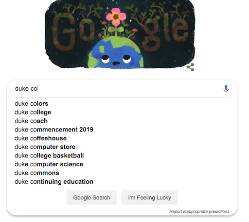
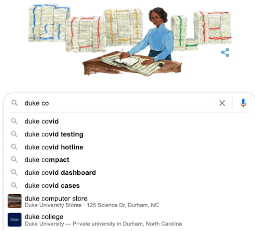

# Project 5: Autocomplete

This is the directions document for Project P5 Autocomplete in CompSci 201 at Duke University, Spring 2022. Please follow the directions carefully while you complete the project. Please refer to the directions at https://coursework.cs.duke.edu/201spring22/p5-autocomplete rather than any forks or local copies in the event that any changes are made to the document.

## Outline 
- [Project Introduction](#project-introduction)
- [Part 1: Run Autocomplete Main](#part-1-run-autocomplete-main)
- [Part 2: Implement the compare method in PrefixComparator](#part-2-implement-the-compare-method-in-prefixcomparator)
- [Part 3: Implement BinarySearchLibrary](#part-3-implement-binarysearchlibrary)
- [Part 4: Finish Implementing topMatches in BinarySearchAutocomplete](#part-4-finish-implementing-topmatches-in-binarysearchautocomplete)
- [Part 5: Implement HashListAutocomplete](#part-5-implement-hashlistautocomplete)
- [Benchmarking and Analysis](#benchmarking-and-analysis)
- [Submitting, Reflect, and Grading](#submitting-reflect-and-grading)

## Project Introduction	

Autocomplete is an algorithm used in many modern software applications. In all of these applications, the user types text and the application suggests possible completions for that text as shown in the example images below taken from google search (on the left in March 2019 and on the right on  October 9, 2020).

Expand for examples

  
  

Although finding terms that contain a query by searching through all possible results is possible, these applications need some way to select only the most useful terms to display (since users will likely not comb through thousands of terms, nor will obscure terms like "duke cookiemonster" be useful to most users). Thus, autocomplete algorithms not only need a way to find terms that start with or contain the prefix, but a way of determining how likely each one is to be useful to the user and displaying "good" terms first. This all needs to be done efficiently so that a user can see completions in real time.

Leverage a `Comparator` in Java as well as the binary search algorithm on sorted data to implement an efficient autocompleter. Create a second implementation based on a `HashMap`. Benchmark and analyze the tradeoffs of these implementations.  

Expand for more optional background on autocomplete

According to one study, in order to be useful the algorithm must do all this in less than 100 milliseconds (see article linked below). If it takes any longer, the user will already be inputting the next keystroke (while humans do not on average input one keystroke every 50 milliseconds, additional time is required for server communication, input delay, and other processes). Furthermore, the server must be able to run this computation for every keystroke, for every user. In this assignment, you will be implementing autocomplete using three different algorithms and data structures. Your autocomplete will be different than the industrial examples described above in two ways:

1. Each term will have a predetermined, constant weight/likelihood, whereas actual autocomplete algorithms might change a term's likelihood based on previous searches.
2. We will only consider terms which start with the user query, whereas actual autocomplete algorithms (such as the web browser example above) might consider terms which contain but do not start with the query.

The article linked below describes one group's recent analysis of different data structures to implement autocomplete efficiently. You'll be implementing a version of what they call a prefix hash tree, though we'll use a prefix hash list which is more efficient when terms aren't updated dynamically.
- https://medium.com/@prefixyteam/how-we-built-prefixy-a-scalable-prefix-search-service-for-powering-autocomplete-c20f98e2eff1

### Acknowledgements
The assignment was developed by Kevin Wayne and Matthew Drabick at Princeton University for their Computer Science 226 class. Former head CompSci 201 UTAs, Arun Ganesh (Trinity '17) and Austin Lu (Trinity '15) adapted the assignment for Duke with help from Jeff Forbes. Josh Hug updated the assignment and provided more of the testing framework. The current version is the result of simplification done in Fall 2018 and then modified again in Spring 2019 based on the article above and experience from previous semesters. The version in Fall 2020 reflects updates to the java.util.Comparator API, now updated for academic year 2021-2022.
